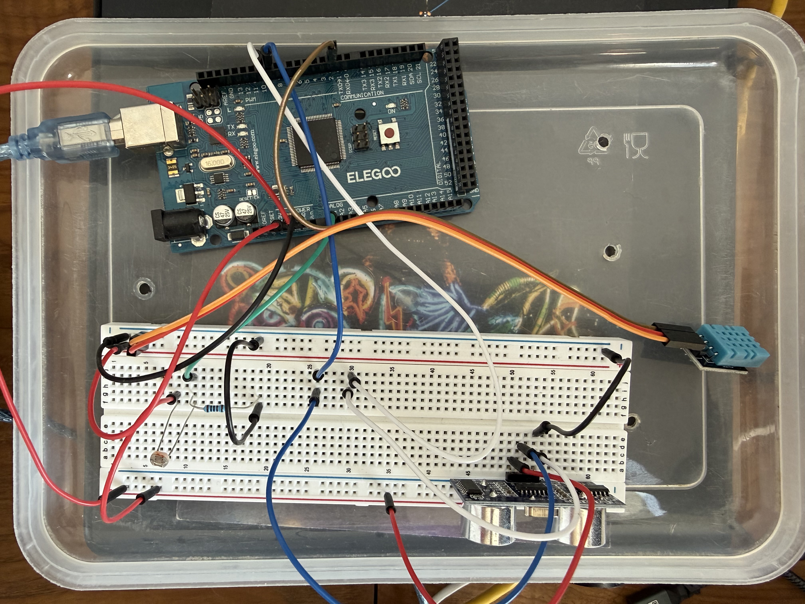

# Arduino

My experiments and learning with Arduino originally started as a way to geek out with my kid around his studies, but it looks like I might be even more motivated than him to push the experiments further! 😄

## The board

## Repository structure

| Directory      | Description                                                                 |
|----------------|-----------------------------------------------------------------------------|
| `sensors/`     | Full pipeline: Arduino sketch → serial reader → MariaDB → Grafana → website |
| `sonic/`       | HC-SR04 ultrasonic distance sensor sketch                                   |
| `serial/`      | Python demo for reading serial data from an Arduino                         |
| `arduino-cli/` | Arduino CLI binary for compiling and uploading sketches without the IDE      |
