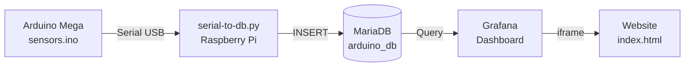
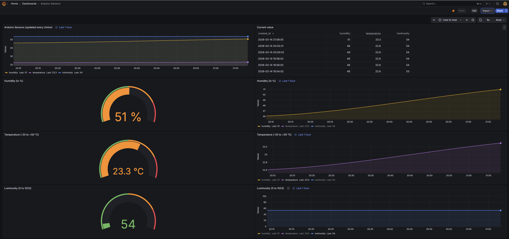
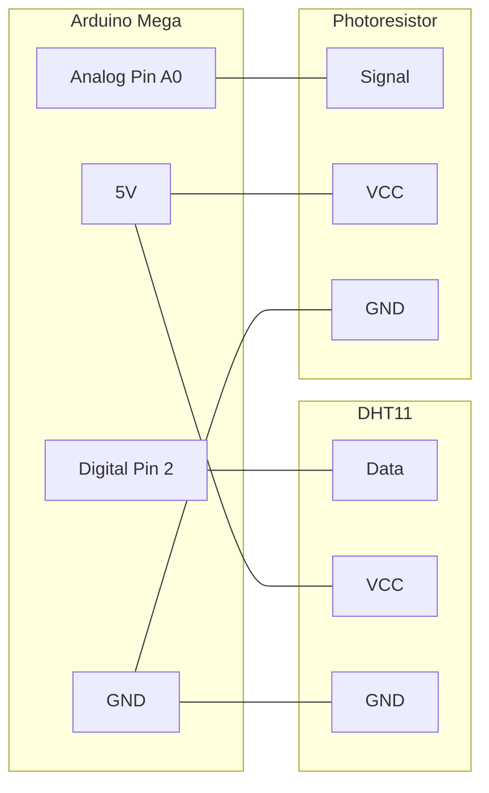

# Sensors – Home Environment Monitoring

## Purpose

A complete pipeline to collect environmental metrics (temperature, humidity, luminosity) from an Arduino Mega equipped with a **DHT11** sensor and a **photoresistor**, store them in **MariaDB**, visualize them in **Grafana**, and display the dashboard on a simple **website**.

## How it works



1. **`sensors.ino`** — Arduino sketch that reads sensors every 2 minutes and sends a CSV line over serial (`temperature,humidity,luminosity`)
2. **`serial-to-db.py`** — Python script running on the Raspberry Pi that captures serial data and inserts it into MariaDB
3. **MariaDB** — Stores all readings in the `sensors` table (see `mariadb/`)
4. **Grafana** — Connects to MariaDB and provides a public dashboard for visualization
5. **Website** — Embeds the Grafana dashboard in a clean, easy-to-use web page (see `website/`)

### Grafana dashboard preview



## Arduino wiring



| Sensor        | Arduino Pin | Description               |
|---------------|-------------|---------------------------|
| DHT11 Data    | Digital 2   | Temperature and humidity   |
| Photoresistor | Analog A0   | Luminosity (0–1023)        |
| VCC           | 5V          | Power for both sensors     |
| GND           | GND         | Ground for both sensors    |

## Serial output example

```
17.10,44.00,43
22.50,55.00,512
```

Baud rate: **9600** — one reading every **2 minutes**.

## Directory structure

| Path            | Description                                      |
|-----------------|--------------------------------------------------|
| `sensors.ino`   | Arduino sketch collecting sensor data            |
| `serial-to-db.py` | Python script: serial reader → MariaDB        |
| `mariadb/`      | Database setup scripts and test                  |
| `website/`      | Static site embedding the Grafana dashboard      |
| `venv/`         | Python virtual environment (pyserial, mariadb)   |
| `Arduino/`      | Earlier iterations of the serial-to-db scripts   |
| `arduino-cli/`  | Sketches managed via the Arduino CLI             |
