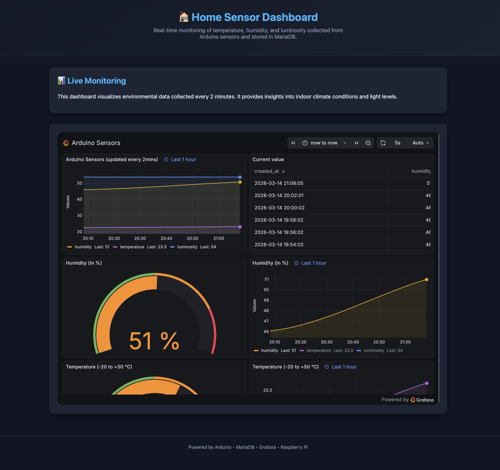

# Website – Sensor Dashboard

## Purpose

A simple static website that displays a **Grafana dashboard** embedded in an iframe, showing real-time sensor metrics (temperature, humidity, luminosity) collected by the Arduino and stored in MariaDB.

## Files

- **`index.html`** — Styled dashboard page with a dark theme, header, and embedded Grafana iframe
- **`index-simple.html`** — Minimal full-screen version that only shows the Grafana iframe
- **`site.webmanifest`** — Web app manifest for PWA/favicon support

## How it works

1. The Arduino reads sensor data and sends it over serial
2. A Python script inserts the data into MariaDB
3. Grafana connects to MariaDB and builds a public dashboard
4. This website embeds the Grafana public dashboard in an iframe

## Running locally

Serve the site with Python's built-in HTTP server:

```bash
python3 -m http.server 8080
```

Then open `http://localhost:8080` in a browser.

## Website preview


