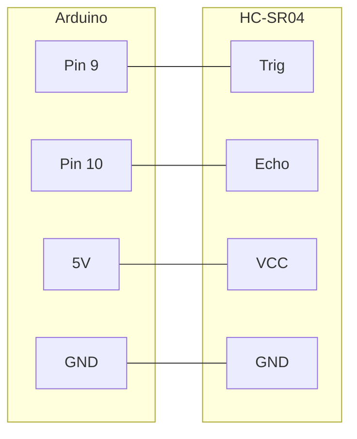

# Sonic – HC-SR04 Ultrasonic Sensor

## Purpose

This Arduino sketch reads distance measurements from an **HC-SR04 ultrasonic sensor** and prints them over serial.

## How it works

1. The trigger pin sends a short ultrasonic pulse
2. The echo pin listens for the reflected signal
3. The travel time is converted to a distance in centimeters using the speed of sound
4. The result is printed to the serial monitor every 3 seconds

## Wiring

| HC-SR04 Pin | Arduino Pin |
|-------------|-------------|
| Trig        | 9           |
| Echo        | 10          |
| VCC         | 5V          |
| GND         | GND         |



## Serial output example

```
Distance: 24.57
Distance: 25.01
```

Baud rate: **9600**
